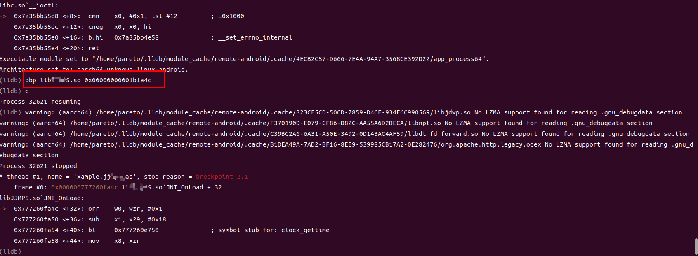

# pbp

PDP - Python scipt for lldb , support android only.

## Key Feature

* lldb debug script , use for setting breakpoint at unloaded module. 


## Installation

```
git clone https://github.com/doom-man/pbp ~/pbp
echo "command script i ~/pbp/pbp.py"  >> ~/.lldbinit
echo "DONE! enjoy"
```


## usage

```bash
pbp libxxx.so 0x123
```


## ScreenShot




